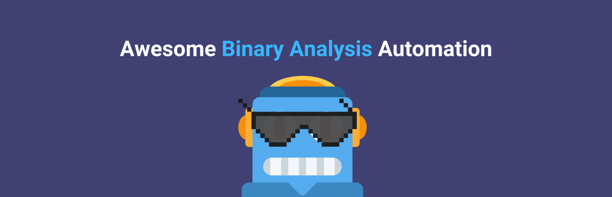

# Awesome Binary Analysis Automation
<p align="center">
   
 </a>
</p>


<p align="center">
A comprehensive list of tools and resources for automating binary analysis, vulnerability research, and reverse engineering using various techniques like machine learning, scripting, and static/dynamic analysis.


<div align="center">


[](https://github.com/user1342/Awesome-Binary-Analysis-Automation)


<br>
[](https://ko-fi.com/P5P7C2MM6)


</div>

# How to Use
Awesome-Android-Reverse-Engineering is an amazing list for people who work in taking apart Android applications, systems, or components. Simply press ```ctrl + F``` to search for a keyword, go through our Contents Menu, or lookout for a '☆' indicating some great and up-to-date resources.


## Decompilers/ Dissasemblers
- [IDA Pro](https://hex-rays.com/ida-pro/) - Advanced disassembler and reverse engineering tool with extensive scripting capabilities.
- [☆ Ghidra](https://ghidra-sre.org/) - NSA's reverse engineering framework offering disassembly, decompilation, and scripting.
- [☆ Binary Ninja](https://binary.ninja/) - Known for its intuitive UI and powerful scripting capabilities for various binary analysis tasks.
- [☆ Radare2](https://www.radare.org/) - Open-source framework for reverse engineering and binary analysis.
- [Hopper](https://www.hopperapp.com/) - Disassembler for macOS and Linux with decompiling and debugging capabilities.
- [Jakstab](https://www.jakstab.org/) - Integrated disassembly and static analysis framework.
- [GTIRB](https://github.com/GrammaTech/gtirb) - IR Binary analysis and rewriting data structure.
  
## Automated Reverse Engineering
- [Firmware-Mod-Kit](https://github.com/rampageX/firmware-mod-kit) - Collection of scripts for modifying firmware images.
- [☆ Binwalk](https://github.com/ReFirmLabs/binwalk) - For firmware analysis, extraction, and reverse engineering.
- [Firmwalker](https://github.com/craigz28/firmwalker) - A script for searching the extracted firmware file system for goodies.
- [Srecord](http://srecord.sourceforge.net/) - Tools for manipulating EPROM load files.
- [Pharos](https://github.com/cmu-sei/pharos) - Carnegie Mellon University’s framework for automating reverse engineering tasks.
- [Triton](https://triton.quarkslab.com/) - Dynamic Binary Analysis (DBA) framework.
- [Echo](https://github.com/Washi1337/Echo) - Static analysis, symbolic execution, and emulation framework.
- [LIEF](https://lief.quarkslab.com/) - Parses, modifies, and abstracts binary formats.

## Automated Vulnerability Detection
- [Fwanalyzer](https://github.com/cruise-automation/fwanalyzer) - Firmware security analysis.
- [☆ Flawfinder](https://github.com/david-a-wheeler/flawfinder) - Tool for analyzing the entropy of firmware files.
- [Fdiff](https://github.com/david-a-wheeler/flawfinder) - Identifies potential security flaws in source code.
- [Checksec](https://github.com/slimm609/checksec.sh) - Security checks for binaries.
- [Cwe_checker](https://github.com/fkie-cad/cwe_checker) - Identifies common bug patterns in binaries.
- [Searchsploit](https://www.exploit-db.com/searchsploit) - Command-line search tool for Exploit Database.
- [CVE Search](https://github.com/cve-search/cve-search) - Searching for known vulnerabilities.
- [Exploitdb](https://www.exploit-db.com/) - An archive of public exploits and corresponding vulnerable software.
- [Dependency-check](https://github.com/jeremylong/DependencyCheck) - A software composition analysis utility that detects publicly disclosed vulnerabilities in application dependencies.
- [BinSkim](https://github.com/microsoft/binskim) - Analyzes PE and ELF binary formats for security and correctness.

## Automated Malware Detection
- [Yara](https://github.com/VirusTotal/yara) - Malware detection and classification.

## Emulation and Fuzzing
- [☆ QEMU](https://www.qemu.org/) - Emulator for hardware virtualization used by EMBA for live testing modules.
- [Firmadyne](https://github.com/firmadyne/firmadyne) - A full-system emulation tool for analyzing Linux-based firmware.
- [☆ Unicorn Engine](https://www.unicorn-engine.org/) - CPU emulator framework used for binary analysis and vulnerability research.
- [AFL++ (American Fuzzy Lop)](https://github.com/AFLplusplus/AFLplusplus) - Fuzzing framework for vulnerability discovery.
- [LibFuzzer](https://llvm.org/docs/LibFuzzer.html) - In-process fuzzing tool targeting specific functions.
- [DECAF](https://github.com/sycurelab/DECAF) - QEMU-based binary analysis platform.
- [DeepState](https://github.com/trailofbits/deepstate) - Framework for symbolic execution and fuzzing engines.

## Binary Feature Extraction
- [☆ bin2ml](https://github.com/br0kej/bin2ml) - Extracting ML-ready data from software binaries.

## Function Comparison and Diffing
- [FASER](https://github.com/br0kej/FASER) - Cross-Architecture Function Similarity Search Model.
- [☆ Tweezer](https://github.com/user1342/tweezer) - Identifies unknown function names in binaries.
- [Just Another Differ](https://github.com/user1342/jad) - Diffing tool for binary files.

## Books
- [Deep Learning: A Visual Approach](https://nostarch.com/deep-learning-visual-approach) - Introduces deep learning in an accessible way, using color illustrations and real-world examples.

## Videos
- [Machine Learning & Program Analysis](https://ringzer0.training/archive/2022-august/machine-learning-program-analysis.html) - Discusses the application of ML to program analysis.

## Misc
- [DynamoRIO](https://www.dynamorio.org) - Runtime code manipulation system for dynamic analysis.
- [Gdbgui](https://www.gdbgui.com) - Browser-based frontend for GNU Debugger.
- [Insight](https://insight.labri.fr/) - Focuses on binary analysis for various purposes.
- [Kaitai Struct](http://kaitai.io/) - Describes binary data structures in files or memory.

